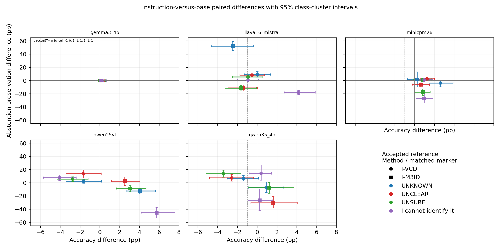

# Abstention under Visual Contrastive Decoding: A Controlled Five-Model Study

## Abstract

Visual contrastive decoding changes both which answers a vision-language model produces and when it abstains. We study these coupled effects in food recognition using five fixed models, 352 decoding and prompt conditions, and 853,248 generated responses. Each condition evaluates the same 2,424 images from 101 food categories. Four abstention expressions are crossed between the main and reference prompts. We evaluate answer accuracy, selective prediction, and the preservation of original abstentions using a reference constructed from category likelihoods and ten independent answers per image. VCD improves accuracy in 14 of 20 matched-expression model conditions, while reasonable-abstention preservation decreases with a negative 95% interval in 16 of the 19 conditions with a defined preservation set. Separating the guided base distribution from an unguided visual contrast yields conditional improvements: instruction-preserving VCD meets both a one-percentage-point accuracy noninferiority criterion and an abstention-preservation improvement criterion in two conditions. A simple control that retains every original abstention supplies a strong preservation endpoint with a measurable accuracy–coverage tradeoff. The results support evaluating visual contrast jointly with abstention and reporting prompt-specific effects.

## 1. Introduction

An abstaining vision-language model distinguishes producing a concrete answer from acknowledging insufficient evidence. A decoding intervention can alter both decisions. Consider a model that responds UNKNOWN to a food image. A visual contrast may replace that response with a correct dish name, an incorrect name, or another abstention. Overall accuracy assigns different values to the first two outcomes, while the reliability of the intervention also depends on which original abstentions it preserves. This creates a joint evaluation problem for decoding methods used with explicit abstention instructions.

Visual contrastive decoding (VCD) and multimodal mutual-information decoding (M3ID) modify token preferences using visual reference distributions [2,3]. Related methods use layer distributions, attention-derived visual references, or entropy-calibrated contrasts [4–7]. These interventions operate inside prompts that also specify desired answer behavior. The abstention expression and guidance included in the reference prompt can therefore influence the observed answer–abstention tradeoff. A controlled comparison needs to hold the evaluated images and main prompt fixed while exposing these reference choices.

We examine this problem with five fixed vision-language models and a complete registered prompt and method panel. Our evaluation separates concrete answer accuracy from retention of original abstentions supported by a fixed operational reference. We also test an instruction-preserving contrast that adds an unguided visual increment to the guided normal-image distribution. Three findings structure the paper: accuracy gains often accompany substantial losses of original abstentions; the tradeoff varies sharply across models and abstention expressions; and instruction preservation helps in specific conditions while a simple original-abstention control establishes an informative comparison. Condition-level counts, paired intervals, scoring decisions, and response-to-result provenance accompany the results.

## 2. Related work

VCD compares original and distorted-image conditions to reduce object hallucination [2]. M3ID amplifies image-grounded information relative to a language-driven reference [3]. Self-Introspective Decoding constructs a reference through selective visual attention [7]. DoLa and DeCo operate on intermediate-layer predictions [4,5]. We place these methods in a common naming task and measure answer transitions under four abstention expressions.

Abstention-aware evaluation connects this work to reliable visual question answering [8]. Contrastive Decoding with Abstention (CDA) combines answering and abstention through contrastive scores and entropy information [6]; we include the registered visual transfer of that construction. Instruction Contrastive Decoding manipulates a reference through instructions [9]. Our instruction-preserving variants use a guided base with an unguided normal/reference visual difference. The additive base-plus-difference family also appears in DExperts [10]. The specific prompt decomposition and its behavioral tradeoff are the focus here.

Food-101 supplies existing category labels and a standard image-classification evaluation [1]. A fixed-category classifier permits direct comparison of predicted class IDs with those labels. Our generative setting adds a finite extraction step because a response can name a dish in a sentence, give several alternatives, describe a side dish, or abstain. We make that rule explicit and report a stricter literal-name sensitivity alongside the primary score.

## 3. Task, methods, and evaluation

### 3.1 Answer extraction and correctness

For each image, the model generates at most 32 new tokens. A target-independent parser and exact question–answer review registry identify the explicit primary dish. The predicted category is matched against the 101 original Food-101 class names and their underscore-to-space forms, with case and surrounding formatting normalized. For example, “The dish is fried rice.” predicts `fried_rice`; “Seared scallops with mashed potatoes” predicts `scallops`, while the accompaniment is retained as a side-dish role.

Cooking and flavor modifiers remain in the extracted name. Primary scoring uses complete canonical word boundaries within that primary name. A separate literal-name score requires equality of the complete extracted name with an allowed class form. The class vocabulary retains original singular/plural forms and spelling. Equal-ranking competing primary categories receive an ambiguous single-label prediction and zero correctness. Explicit noncanonical names also receive zero correctness. A phrase such as “probably sushi” retains its concrete class prediction.

Abstention is recorded from the prescribed marker or a clear refusal or inability to identify the food. Concrete answers, including uncertainly phrased answers, retain the answer decision. Each formal output has binary correctness, literal sensitivity, and abstention fields. Exact question–answer reuse and finite rules handle repeated outputs; targeted root review resolves remaining metric-relevant boundaries. These are automatic annotations and automatic reviews with recorded provenance.

### 3.2 Operational reference for abstention

For each model–image pair, we score all 101 category names by mean token log likelihood and generate ten independent answers with temperature 1 and top-p 1. Let \(r_i\) denote the ground-truth category's rank and \(k_i\) the number of correct independent answers. The fixed operational reference is

\[
G_i=\mathbf{1}[r_i>1\ \land\ k_i=0].
\]

It identifies examples for which the correct category loses the closed-set ranking and all ten independent answers fail. The reference covers 24,240 model–image pairs across development and evaluation splits and 242,400 independent answers.

We report two reference tables. The accepted-reference table preserves the previously accepted Qwen2.5-VL, LLaVA, and MiniCPM values and uses the current rule for Qwen3.5 and Gemma3. The uniform-reference table applies the current extraction rule to all five models. Among the 14,544 legacy pairs, 13,833 retain their value, 400 change from positive to negative, and 311 change from negative to positive. The previously recorded 130 unique census/reference conflicts remain separately listed. These references operationalize performance under the fixed category space and ten-answer budget.

### 3.3 Decoding conditions

The panel includes direct greedy decoding, VCD, M3ID, DoLa, DeCo, SID on its two registered supported models, instruction-preserving VCD and M3ID, the visual CDA transfer, and reference-instruction removal. VCD uses contrast coefficient 1 and plausibility threshold 0.1. M3ID uses time coefficient 0.02 and gate threshold 0.3. The recorded implementations retain their model-specific layers, visual attention, and full-vocabulary conditional scores.

For guided original-image distribution \(g\), unguided original-image distribution \(c\), and unguided reference-image distribution \(r\), the instruction-preserving score has the form

\[
s_i=\log g_i+\alpha_t(\log c_i-\log r_i),\qquad i\in S_t.
\]

Instruction-VCD uses its fixed contrast weight. Instruction-M3ID uses the registered gate and time-dependent weight computed on the unguided normal condition. Candidate support and other method parameters follow the frozen implementation.

Four main-prompt expressions—UNKNOWN, UNCLEAR, UNSURE, and “I cannot identify it”—are crossed with four reference expressions for the registered visual-reference methods. Layer methods and instruction-preserving variants use their registered expression conditions. Reference-instruction-removal controls keep the guided main prompt and remove guidance from the reference.

The registered **copy original abstention** control selects the complete direct response whenever direct decoding abstains and otherwise selects the complete corresponding VCD or M3ID response. Selection reads only the direct abstention decision. It produces 200 derived condition tables from existing outputs and permits 40 matched comparisons with instruction-preserving decoding.

### 3.4 Metrics and paired inference

For correctness \(C_i\) and abstention \(A_i\), we report accuracy, coverage \(\Pr(A_i=0)\), selective accuracy \(\Pr(C_i=1\mid A_i=0)\), and abstention precision and recall against \(G_i\). To evaluate retention, we fix the subset on which direct decoding abstains and \(G_i=1\), then measure each method's abstention rate on that same subset. This holds the comparison population constant when methods change their answers.

For instruction-preserving methods, correction retention uses cases on which direct gives a concrete incorrect answer and the corresponding base contrast gives a correct answer. An additional all-input denominator includes direct abstentions. Both definitions retain their numerators and denominators.

Every method cell is paired with the observed direct main-prompt condition for the same model, image, marker, guidance, and replicate. Instruction-preserving variants also receive comparisons with their base method and copy-original-abstention control. Intervals use 2,000 shared paired bootstrap resamples of 101 target-class clusters. Subgroup rates use pooled numerators and denominators within each resample. We evaluate accuracy noninferiority at a margin of one percentage point and preservation improvement when the lower 95% bound exceeds zero. The full matrix is reported with pointwise intervals.

## 4. Experimental setup

The original Food-101 dataset contains 101,000 images across 101 categories [1]. We use the project's fixed balanced sample of 4,848 Food-101 images: 2,424 development images and 2,424 evaluation images, with 24 images per class in each split. Reported method comparisons use the evaluation split.

The five fixed models are Qwen2.5-VL-7B-Instruct, Qwen3.5-4B, LLaVA-v1.6-Mistral-7B, MiniCPM-V2.6, and Gemma3-4B-it. Generation retains recorded BF16 precision, weights, processors, image handling, templates, seeds, and method parameters. The formal panel contains 352 conditions and 853,248 outputs: 193,920 each for Qwen2.5-VL and LLaVA, and 155,136 each for the other models. Closed-set records cover 24,240 model–image pairs.

The final scorer was independently replayed over all 853,248 outputs with exact agreement in correctness, literal sensitivity, abstention, and raw-source identity. Each cell contains 101 classes with 24 examples each. The 372 main paired comparisons contain 901,728 sample-condition pair checks with matching main-prompt identities and seeds. The copy control adds 484,800 deterministic source selections and 40 paired comparisons.

## 5. Results

### 5.1 Accuracy and abstention move together

Table 1 shows the exact UNKNOWN/UNKNOWN slice. Entries contain accuracy and abstention rate in percent, each over 2,424 images. The complete 352-condition table accompanies the paper.

| Method | Qwen2.5-VL | Qwen3.5 | LLaVA | MiniCPM | Gemma3 |
|---|---:|---:|---:|---:|---:|
| Direct | 25.12 / 58.50 | 46.33 / 20.54 | 28.42 / 19.88 | 35.93 / 8.25 | 54.66 / 0.00 |
| VCD | 33.37 / 31.72 | 48.51 / 3.59 | 35.15 / 1.86 | 38.16 / 1.73 | 52.68 / 0.04 |
| M3ID | 25.33 / 56.11 | 49.01 / 5.86 | 32.80 / 5.69 | 36.47 / 5.36 | 54.54 / 0.00 |
| DoLa | 32.67 / 27.52 | 46.62 / 21.04 | 28.63 / 19.43 | 23.60 / 1.07 | 54.29 / 0.04 |
| DeCo | 24.55 / 59.82 | 44.06 / 27.60 | 28.22 / 20.79 | 35.77 / 8.91 | 54.54 / 0.00 |
| SID | 34.41 / 31.15 | — | 36.26 / 0.66 | — | — |
| I-VCD | 31.72 / 35.40 | 47.11 / 4.99 | 35.15 / 3.92 | 40.76 / 1.40 | 52.72 / 0.04 |
| I-M3ID | 29.37 / 46.53 | 49.92 / 4.33 | 30.32 / 16.58 | 36.72 / 5.20 | 54.62 / 0.00 |
| CDA (visual) | 33.91 / 15.59 | 26.28 / 6.31 | 31.31 / 0.33 | 19.60 / 0.00 | 30.61 / 1.03 |

**Table 1.** Accuracy / abstention rate (%) for UNKNOWN/UNKNOWN. I-VCD and I-M3ID denote instruction-preserving variants. SID is reported on its registered Qwen2.5-VL and LLaVA models; the remaining cells are shown as —.

The strongest accuracy changes frequently coincide with lower abstention. For LLaVA, VCD moves accuracy from 28.42% to 35.15% while abstention falls from 19.88% to 1.86%. SID reaches 36.26% accuracy and 0.66% abstention. Qwen2.5-VL shows a similar transition: VCD increases accuracy from 25.12% to 33.37% and reduces abstention from 58.50% to 31.72%. These changes motivate examining which abstentions disappear.

Across 20 matched-expression model conditions, VCD has higher point accuracy than direct in 14 conditions and a positive accuracy interval in 12. Its reasonable-abstention preservation difference has a negative interval in 16 of 19 conditions with a nonempty reference set. M3ID has higher point accuracy in 16 conditions, a positive interval in nine, and a negative preservation interval in 15 of the 19 defined conditions. SID improves point accuracy in all eight supported matched-expression conditions and reduces preservation in all eight.

Other interventions show distinctive model dependence. MiniCPM accuracy in this slice drops from 35.93% with direct decoding to 23.60% with DoLa and 19.60% with visual CDA. Gemma3's direct condition gives concrete responses to all 2,424 images, producing an empty original-abstention retention set. The full tables retain these denominators so that high-answering and highly abstaining models receive interpretable comparisons.

### 5.2 The abstention expression changes the baseline

The direct decoder reacts differently to the four expressions. LLaVA abstains on 482 images under UNKNOWN and on 2,106 under “I cannot identify it”; accuracy changes from 28.42% to 8.75%. Qwen2.5-VL changes in the opposite direction: UNKNOWN yields 25.12% accuracy and 58.50% abstention, while UNCLEAR yields 39.65% accuracy and 28.18% abstention. Qwen3.5 ranges from 797 abstentions under UNCLEAR to 74 under the sentence-form expression.

Each intervention is therefore evaluated against its own direct main-prompt condition. Reference-expression changes remain explicit dimensions. Removing reference guidance also changes the tradeoff: for Qwen3.5 with UNKNOWN, the VCD reference-removal control has an accuracy difference of −23.18 percentage points and an abstention-recall difference of +37.45 points relative to direct. The reference prompt is a substantive experimental factor.

### 5.3 Instruction preservation has conditional benefits

Across 40 instruction-versus-base comparisons, 26 meet the one-point accuracy noninferiority criterion. Twelve have a positive preservation-improvement interval. Two meet both criteria under each reference table, and both use instruction-VCD.

For MiniCPM under UNCLEAR, instruction-VCD changes accuracy by +1.24 percentage points relative to VCD (95% interval +0.54 to +1.98) and reasonable-abstention preservation by +2.57 points (+1.09 to +4.27). The fixed retention subset contains 428 images under the accepted reference. For Qwen3.5 under “I cannot identify it,” the accuracy difference is +0.37 points (−0.83 to +1.40) and preservation difference is +14.29 points (+4.08 to +27.09), with a 42-image retention subset.

Other conditions expose the tension between objectives. LLaVA instruction-M3ID under UNKNOWN improves preservation by 52.26 points (+45.33 to +59.37) while its accuracy difference is −2.48 points (−4.66 to −0.41). Qwen2.5-VL instruction-M3ID under UNKNOWN improves accuracy by 4.04 points (+2.72 to +5.61) while preservation changes by −12.22 points (−16.62 to −8.26). The paired tradeoff figures show all 40 conditions under both references.

**Figure 1.** Instruction-preserving versus base-method accuracy and original reasonable-abstention preservation differences. Points identify model, expression, and method; intervals use paired class-cluster bootstrap. The [uniform-reference companion figure](../outputs/analysis/main_results/figures/instruction_base_tradeoff_uniform_gt.png) supplies the reference sensitivity analysis.

### 5.4 A simple preservation control establishes the tradeoff

Copy original abstention retains every original abstention by construction. On each defined direct-abstain/reference-positive subset, retention is 100%. Instruction-VCD has higher point accuracy than this control in 19 of 20 matched conditions, with a positive interval in 14. Instruction-M3ID has higher point accuracy in 17 of 20 conditions, with a positive interval in 13. For both methods, preservation is lower in 16 of the 19 defined conditions.

The two favorable instruction-VCD/base comparisons remain informative against this preservation endpoint. MiniCPM under UNCLEAR gains 7.47 accuracy points over copy original abstention (+5.78 to +9.24), together with 19.39 coverage points (+16.50 to +22.40), while retention changes by −34.35 points (−40.05 to −29.00). Qwen3.5 under the sentence-form expression gains 0.83 accuracy points (−0.37 to +1.86) while retention changes by −57.14 points (−71.43 to −42.55).

The simple control makes the design choice explicit. Retaining original abstentions preserves a conservative operating point. Instruction-preserving contrast often answers additional examples correctly and also replaces some original reference-supported abstentions. Applications can select an operating point using accuracy, coverage, and preservation together.

### 5.5 Scoring and reference sensitivity

The literal-name sensitivity isolates the effect of accepting modifiers within an explicit primary dish. For Gemma3 under direct UNKNOWN, primary accuracy is 54.66%, while literal-name accuracy is 37.75%. For LLaVA in the same condition, the values are 28.42% and 27.89%. These differences follow response style and motivate publishing both scores with their extraction rule.

The accepted and uniform references yield the same two instruction-VCD conditions satisfying the joint criterion. Full tables retain changes in precision, recall, and preservation under both references. All ten-answer correct counts are exact, and each reference label has a complete model–image source binding.

## 6. Discussion

The main empirical pattern is a shift in the joint distribution of correct answers, incorrect answers, and abstentions. Visual contrast can recover correct names from examples on which direct decoding abstains and can replace abstentions supported by the operational reference. Evaluating these transitions together makes their practical effect visible.

Instruction preservation offers a specific prompt decomposition and produces useful conditions, particularly MiniCPM–UNCLEAR and Qwen3.5 with the sentence-form marker. The complete comparison also reveals substantial variation across markers and models. A practical claim should identify the model, prompt, target operating point, and direct comparator. The original-abstention control supplies a simple baseline for deciding whether additional coverage justifies the changed preservation profile.

The current evidence supports a behavioral paper centered on this tradeoff. The complete matrix, transition denominators, and matched comparisons provide the explanatory structure. Supplementary mechanism measurements remain future work using the same fixed identities and conditions.

## 7. Scope and limitations

The evaluation covers a balanced 2,424-image Food-101 evaluation subset and five fixed vision-language models. Category and naming conventions determine the primary score. The ten-answer/ranking reference measures a specified operational regime, and both its accepted and uniform forms are reported. Automatic annotation and targeted automatic review retain the possibility of residual extraction error, particularly in unusual multi-food descriptions. The decision registry and literal sensitivity facilitate inspection.

Intervals are pointwise over a broad matrix, so isolated positive conditions are interpreted with their neighboring results. Preservation denominators vary by model and prompt; Gemma3 contributes empty or one-image direct-abstention subsets in the matched conditions. The wider project retains additional models and datasets for future extension.

## 8. Conclusion

Visual contrastive decoding changes abstention alongside accuracy. In a controlled five-model Food-101 panel, improvements in correct naming often accompany losses of original reference-supported abstentions, and their magnitude depends strongly on the abstention expression. Instruction-preserving contrast improves the joint criterion in two specific conditions, while copy original abstention exposes a clear accuracy–coverage–preservation tradeoff. The evidence favors evaluating these quantities jointly and reporting complete prompt-aligned conditions.

## References

1. Lukas Bossard, Matthieu Guillaumin, and Luc Van Gool. *Food-101—Mining Discriminative Components with Random Forests*. ECCV 2014. [Paper](https://data.vision.ee.ethz.ch/cvl/datasets_extra/food-101/static/bossard_eccv14_food-101.pdf).
2. Sicong Leng et al. *Mitigating Object Hallucinations in Large Vision-Language Models through Visual Contrastive Decoding*. CVPR 2024. [Paper](https://arxiv.org/abs/2311.16922).
3. Alessandro Favero et al. *Multi-Modal Hallucination Control by Visual Information Grounding*. CVPR 2024. [Paper](https://openaccess.thecvf.com/content/CVPR2024/html/Favero_Multi-Modal_Hallucination_Control_by_Visual_Information_Grounding_CVPR_2024_paper.html).
4. Yung-Sung Chuang, Yujia Xie, Hongyin Luo, Yoon Kim, James Glass, and Pengcheng He. *DoLa: Decoding by Contrasting Layers Improves Factuality in Large Language Models*. ICLR 2024. [Paper](https://arxiv.org/abs/2309.03883); [official implementation](https://github.com/voidism/DoLa).
5. Chenxi Wang, Xiang Chen, Ningyu Zhang, Bozhong Tian, Haoming Xu, Shumin Deng, and Huajun Chen. *MLLM Can See? Dynamic Correction Decoding for Hallucination Mitigation*. ICLR 2025. [Paper](https://arxiv.org/abs/2410.11779); [official implementation](https://github.com/zjunlp/DeCo).
6. Hyuhng Joon Kim, Youna Kim, Sang-goo Lee, and Taeuk Kim. *When to Speak, When to Abstain: Contrastive Decoding with Abstention*. ACL 2025. [Paper](https://aclanthology.org/2025.acl-long.479/).
7. Fushuo Huo et al. *Self-Introspective Decoding: Alleviating Hallucinations for Large Vision-Language Models*. [Paper](https://arxiv.org/abs/2408.02032).
8. Spencer Whitehead et al. *Reliable Visual Question Answering: Abstain Rather Than Answer Incorrectly*. ECCV 2022. [Paper](https://arxiv.org/abs/2204.13631).
9. Xintong Wang et al. *Mitigating Hallucinations in Large Vision-Language Models with Instruction Contrastive Decoding*. Findings of ACL 2024. [Paper](https://aclanthology.org/2024.findings-acl.937/).
10. Alisa Liu et al. *DExperts: Decoding-Time Controlled Text Generation with Experts and Anti-Experts*. ACL-IJCNLP 2021. [Paper](https://aclanthology.org/2021.acl-long.522/).

## Artifact map

- Complete main condition table: `outputs/analysis/main_results/condition_metrics.csv`.
- Paired comparisons: `outputs/analysis/main_results/paired_comparisons.jsonl`.
- Copy-original-abstention controls and pairs: `outputs/analysis/main_results/controls/`.
- Rules: `docs/SCORING.md`; repeatable entries: `workflows/main_results/`.
- Model, method, source, and environment identities: `data/provenance/frozen_contract/`.
